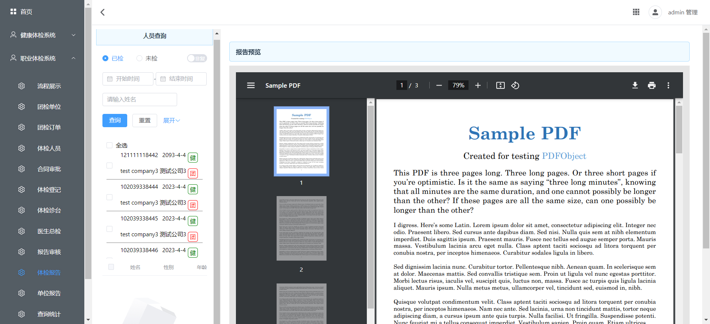
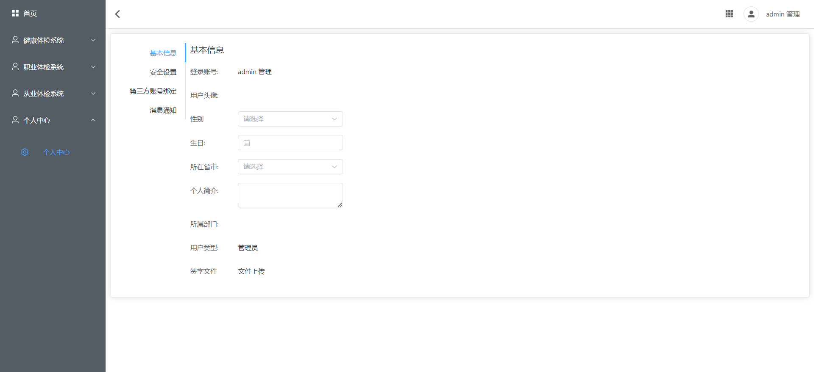
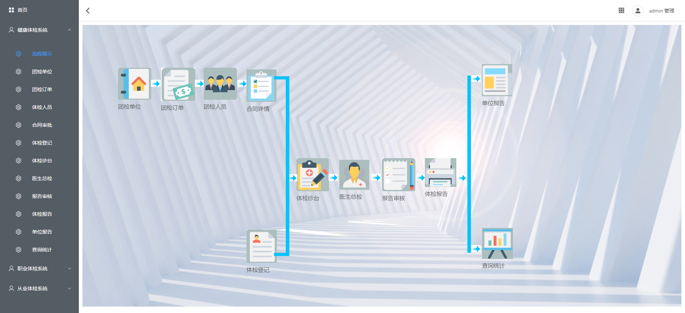
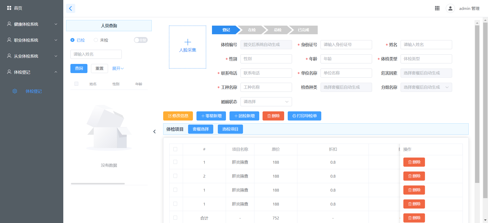

# `healthy-check`

系统相关概念参考：

- https://baike.baidu.com/item/%E4%BD%93%E6%A3%80%E7%B3%BB%E7%BB%9F/1805213
- https://www.sohu.com/a/562837673_121262714

## 项目简介

`healthy-check`是一套高度定制的开源健康体检管理系统，为互联网企业度身打造。它不仅适用于各类体检场景，还能满足职业体检和从业人员的健康评估需求。此系统专为个体体检中心精心打造，能够与医院的各种设备、`LIS、PACS、HIS`等系统完美对接，轻松实现数据录入和生成精准详尽的体检报告。

涵盖了丰富的业务页面功能，包括但不限于：基础数据（科室管理、体检项目、体检套餐等）、系统管理（用户、角色、菜单、数据字典等）、体检单位与订单管理、体检人员记录、体检审核与登记、台账记录与分诊台管理、医生问诊及总检、报告打印、单位报告和数据网报、`LIS`管理、`PACS`管理等。这些功能丰富而全面，为健康体检管理提供了多维度的支持和便捷操作。

## 系统架构图

项目主体骨架基于`Spring Cloud Alibaba`生态体系，使用`MySQL`进行数据持久化管理，采用`Vue3`生态体系与`Element Puls UI`框架完成前端制作，同时项目提供`C++`微服务开发解决方案与集成、使用`Jenkins`实现`CD/CI`。

## 项目结构说明
> `zero-one-healthy-check`  
>
> > `.gitignore` -- 忽略提交配置
> >
> > `README.md` -- 项目自述文件
> >
> > `documents` -- 环境搭建、编码规范、项目需求等等文档资源
> >
> > `healthy-cpp` -- `C++`项目主体
> >
> > `healthy-frontend` -- 前端项目主体

## 软件架构

### `CPP`技术栈

#### 后端核心技术栈

| 技术              | 说明               | 版本                                                   | 备注                                                         |
| ----------------- | ------------------ | ------------------------------------------------------ | ------------------------------------------------------------ |
| `oat++`           | Web框架            | `1.3.0`                                                | https://github.com/oatpp/oatpp                               |
| `MySQL Connector` | `MySQL`连接驱动库  | 8.0.27                                                 | https://dev.mysql.com/downloads/connector/cpp/ https://dev.mysql.com/doc/connector-cpp/1.1/en/connector-cpp-apps.html |
| `JWT`             | `JSON` Web Token   | [v1.4](https://github.com/arun11299/cpp-jwt/tree/v1.4) | https://opensourcelibs.com/lib/cpp-jwt                       |
| `OpenSSL`         | 开源安全套接层协议 | `1.1.1L`                                               | https://www.openssl.org/ https://www.xolphin.com/support/OpenSSL/OpenSSL_-_Installation_under_Windows |

#### 后端扩展技术栈

| 技术       | 说明              | 版本     | 备注                                               |
| ---------- | ----------------- | -------- | -------------------------------------------------- |
| `xlnt`     | excel报表         | 1.5.0    | https://github.com/tfussell/xlnt                   |
| `fastdfs`  | 文件存储客户端    | latest   | https://gitee.com/fastdfs100                       |
| `yaml-cpp` | 解析`yaml`数据    | 0.7.0    | https://github.com/jbeder/yaml-cpp                 |
| `nacos`    | `nacos`客户端     | `v1.1.0` | https://github.com/nacos-group/nacos-sdk-cpp       |
| `redis++`  | `redis`连接客户端 | 1.3.2    | https://github.com/sewenew/redis-plus-plus         |
| `rocketmq` | `rokcetmq`客户端  | 2.1.0    | https://github.com/apache/rocketmq-client-cpp      |
| `mongo`    | `mongodb`客户端   | 3.6.5    | https://www.mongodb.com/docs/drivers/cxx/          |
| `libharu`  | `pdf`库           | 2.4.3    | https://github.com/libharu/libharu/tree/v2.4.3     |
| `zxing`    | 用于绘制各种码    | 2.1.0    | https://github.com/zxing-cpp/zxing-cpp/tree/v2.1.0 |

#### 测试前端技术栈

| 技术         | 说明       | 版本  | 备注                            |
| ------------ | ---------- | ----- | ------------------------------- |
| `jQuery`     | Ajax框架   | 3.6.0 | https://jquery.com/             |
| `HTML5`      | 文本页面   | 5     | https://www.w3schools.com/html/ |
| `CSS3`       | 页面样式表 | 3     | https://www.w3schools.com/css/  |
| `JavaScript` | 页面小脚本 | `ES6` | https://www.w3schools.com/js/   |

## 环境要求

### 开发工具

| 工具            | 说明                  | 版本      | 备注                                                         |
| --------------- | --------------------- | --------- | ------------------------------------------------------------ |
| `Navicat`       | 数据库连接工具        | latest    | https://www.navicat.com.cn/                                  |
| `RDM`           | `Redis`可视化管理工具 | latest    | https://github.com/uglide/RedisDesktopManager https://gitee.com/qishibo/AnotherRedisDesktopManager |
| `PowerDesigner` | 数据库设计工具        | 16.6      | http://powerdesigner.de/                                     |
| `Axure`         | 原型设计工具          | 9         | https://www.axure.com/                                       |
| `MindMaster`    | 思维导图设计工具      | latest    | http://www.edrawsoft.cn/mindmaster                           |
| `Visio`         | 流程图绘制工具        | latest    | https://www.microsoft.com/zh-cn/microsoft-365/visio/flowchart-software |
| `Apipost`       | `API`接口调试工具     | latest    | https://www.apipost.cn/                                      |
| `Mock.js`       | `API`接口模拟测试     | latest    | http://mockjs.com/                                           |
| `Git`           | 项目版本管控工具      | latest    | https://git-scm.com/                                         |
| `Codeup`        | 项目源码托管平台      | latest    | https://codeup.aliyun.com                                    |
| `Projex`        | 开发过程管控平台      | latest    | https://devops.aliyun.com/projex                             |
| `IDEA`          | `Java`开发`IDE`       | 2022.1.3+ | https://www.jetbrains.com/idea/download                      |
| `Apache Maven`  | Maven 构建工具        | 3.6.3     | https://maven.apache.org/                                    |
| `Docker Maven`  | Maven Docker插件      | 0.40.2    | https://dmp.fabric8.io/ https://github.com/fabric8io/docker-maven-plugin |
| `VS`            | `C++`开发`IDE`        | 2022      | https://learn.microsoft.com/en-us/visualstudio/releases/2022/release-notes |
| `Cmake`         | `C++`跨平台编译       | latest    | https://cmake.org/cmake/help/latest/index.html               |

### 开发环境

| 依赖环境  | 版本       | 备注                      |
| --------- | ---------- | ------------------------- |
| `Windows` | 10+        | 操作系统                  |
| `JDK`     | 1.8.0_191+ | https://www.injdk.cn/     |
| `NodeJS`  | 16.17.0    | https://nodejs.org/zh-cn/ |
| `NPM`     | 8.19.2     | https://www.npmjs.com/    |

### 服务器环境

| 依赖环境    | 版本                                                         | 备注                                                         |
| ----------- | ------------------------------------------------------------ | ------------------------------------------------------------ |
| `Anolis OS` | `8.6GA`                                                      | https://openanolis.cn/anolisos                               |
| `Docker`    | latest                                                       | https://www.docker.com/                                      |
| `MySQL`     | 8.0.20                                                       | https://www.mysql.com/cn/                                    |
| `Redis`     | 6.2.7                                                        | https://redis.io/                                            |
| `Nacos`     | 2.1.0                                                        | https://nacos.io/zh-cn/docs/quick-start-docker.html          |
| `Sentinel`  | 1.8.4                                                        | https://github.com/alibaba/Sentinel/releases                 |
| `Seata`     | 1.5.1                                                        | https://github.com/seata/seata                               |
| `RocketMQ`  | 4.9.3                                                        | https://rocketmq.apache.org/                                 |
| `Nginx`     | latest                                                       | https://nginx.org/en/                                        |
| `FastDFS`   | [V6.07](https://github.com/happyfish100/fastdfs/releases/tag/V6.07) | https://gitee.com/fastdfs100                                 |
| `ELK`       | 7.6.2                                                        | https://www.elastic.co/guide/en/elastic-stack/7.6/index.html |
| `MongoDB`   | 4.4.17                                                       | https://www.mongodb.com/try/download/community               |
| `Jenkins`   | latest                                                       | https://www.jenkins.io/zh/doc/book/installing/               |

## 特别鸣谢

`zero-one-healthy-check`的诞生离不开开源软件和社区的支持，感谢以下开源项目及项目维护者：

- `spring`：https://github.com/spring-projects
- `alibaba`：https://github.com/alibaba
- `mybatis`：https://github.com/mybatis/mybatis-3.git
- `mp`：https://github.com/baomidou
- `api`：https://gitee.com/xiaoym/knife4j
- `vue`：https://github.com/vuejs
- `ui`：https://github.com/ElemeFE
- `oatpp`：https://github.com/oatpp/oatpp
- `业务参考项目`：https://gitee.com/scmt1/healthyCheck-backend

同时也感谢其他没有明确写出来的开源组件提供给与维护者。

## 部分功能效果预览

## 支持一下

如果觉得框架和项目还不错，点个⭐Star，这将是对开源作者们的极大的鼓励与支持。